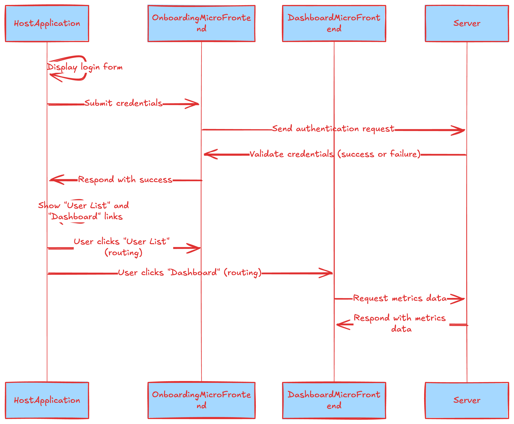

## Overview of Module Federation in Webpack

This project demonstrates how micro frontends can be used by independent teams to perform their own tasks. This is achieved using module federation of Webpack 5.

### Module Federation

**Key Features:**

- **Dynamic Remotes**: Load code from remote applications at runtime.
- **Shared Dependencies**: Share libraries like React or Lodash across different applications to avoid duplication.
- **Independent Deployment**: Each micro frontend can be deployed independently, allowing for faster iterations and deployments.
- **Version Compatibility**: Handle different versions of shared libraries gracefully.

**Benefits:**

- **Scalability**: Break down large applications into manageable, smaller pieces.
- **Team Autonomy**: Different teams can work on separate micro frontends without stepping on each other's toes.
- **Performance Optimization**: Load only the necessary code, potentially improving load times.
- **Flexibility**: Easily integrate new features or replace existing ones without a complete rebuild.

## Architecture Components

### Diagram

### Host

- **Role**: Serves as the primary application shell that integrates all micro frontends.
- **Module Federation Configuration**: Acts as the consumer (host) and defines remotes (micro frontends) it can consume.

### Onboarding

- **Role**: Manages users and authentication/authorization.
- **Module Federation Configuration**: Acts as a remote that the Host can consume.

### Dashboard

- **Role**: Displays data metrics and KPIs.
- **Module Federation Configuration**: Acts as another remote for the Host. Currently, it serves dummy data, but it can be extended to integrate with the server for more comprehensive functionality.

### Server

- **Role**: Provides APIs and handles JWT-based authentication.
- **Note**: While not a frontend, it supports the authentication mechanisms used by the micro frontends.

## Sequence diagram

## Tech Stack

- **Frontend**: React, TypeScript, Tailwind CSS
- **Backend**: Node.js, Express, NestJS
- **Build Tools**: Webpack 5, Babel
- **Testing**: Jest, React Testing Library, Cypress
- **Authentication**: JWT (JSON Web Tokens)
- **API**: RESTful APIs

## Integration Flow

### Development

Each micro frontend (Onboarding, Dashboard) is developed as an independent Webpack build with its own Module Federation configuration.

### Deployment

Micro frontends are deployed independently, possibly on different servers or CDNs.

### Runtime Integration

The Host application dynamically loads the required micro frontends at runtime using Module Federation, ensuring that the user experiences a cohesive application.

## Testing Strategy

### Contents

**Testing Objectives:**

Currently, unit tests are added in the onboarding directory for the login module and e2e tests are added for the host application using Cypress.

- Validate individual micro frontends.
- Ensure seamless integration within the Host.
- Verify authentication flows and API interactions.

**Testing Types:**

- **Unit Testing**: Test individual components and utilities within each micro frontend.
  - **Tools**: Jest, React Testing Library.
- **End-to-End (E2E) Testing**: Simulate real user interactions across the entire application.
  - **Tools**: Cypress, Playwright.

**Testing Tools and Libraries:**

- **Jest**: JavaScript testing framework.
- **React Testing Library**: For testing React components.
- **Cypress**: For E2E testing.

## Contributing

To contribute to this project, follow these steps:

1. Fork the repository.
2. Create a new branch (`git checkout -b feature-branch`).
3. Make your changes.
4. Commit your changes (`git commit -m 'Add some feature'`).
5. Push to the branch (`git push origin feature-branch`).
6. Open a pull request.

### Improvements

**Continuous Integration (CI):**

- Integrate testing into CI pipelines (e.g., GitHub Actions, Jenkins).
- Ensure tests run on every commit and pull request.

**Code Coverage:**

- Set coverage thresholds.

**Integration Testing**: Test interactions between micro frontends and the Host.
